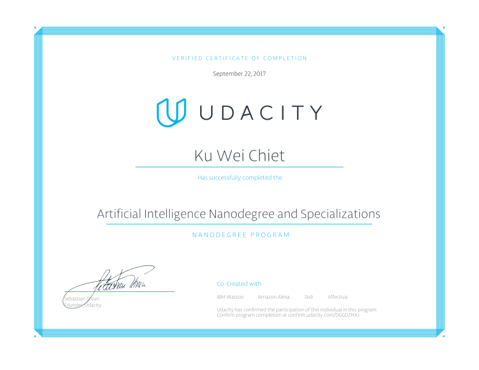

# Artificial Intelligence Nanodegree

## Program Description
Global innovations in the field of artificial intelligence (AI) are going to redefine virtually every aspect of our lives. Students who master AI skills today will play a critical role in helping determine how this incredible technology impacts our future. This program will introduce you to the broad field of artificial intelligence, and prepare you for a wide variety of opportunities in the AI field.

[Graduation Certificate](https://confirm.udacity.com/DGGDZHXJ)

## Course Syllabus
* [Term 1](https://medium.com/udacity/ai-nanodegree-program-syllabus-term-1-in-depth-80c41297acaf): Foundations of AI  
* [Term 2](https://medium.com/udacity/ai-nanodegree-program-syllabus-term-2-deep-learning-in-depth-d935197b66ec): Deep Learning and Applications

## Course Projects
* [Term 1](https://github.com/weichiet/Artificial-Intelligence-Nanodegree-Term-1)
* [Term 2](https://github.com/weichiet/Artificial-Intelligence-Nanodegree-Term-2)
